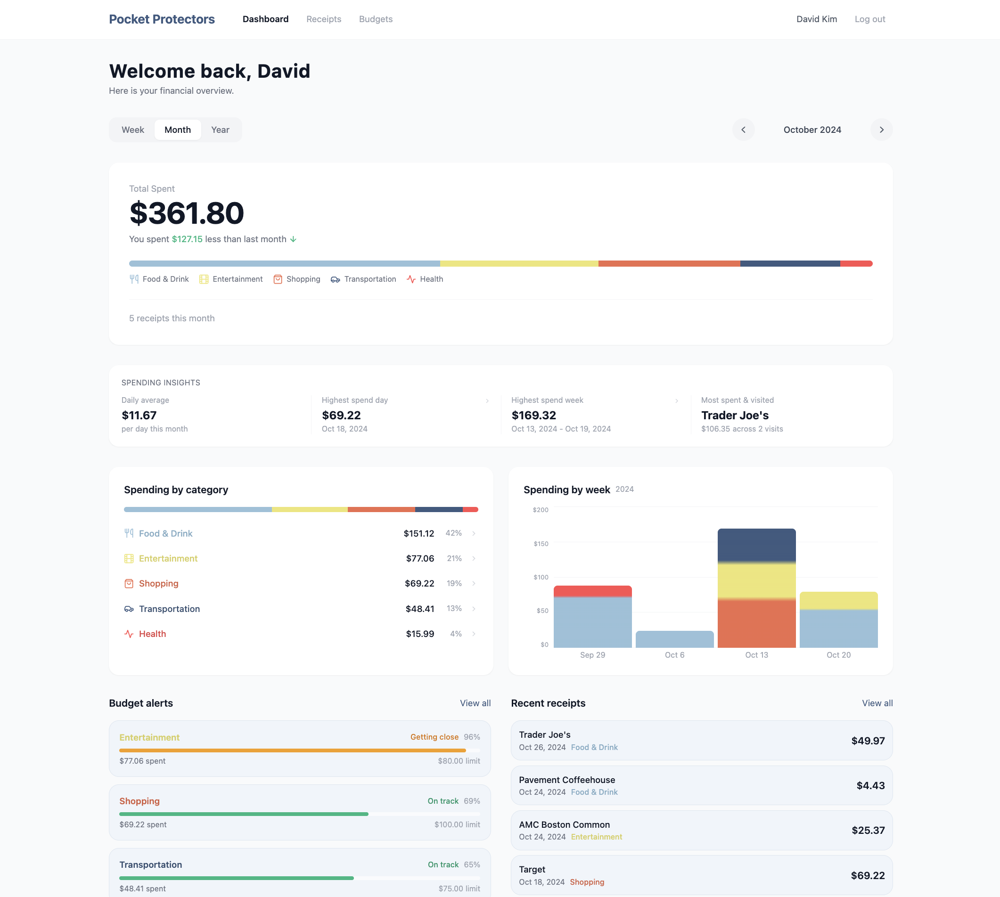

# Pocket Protectors

Personal finance tracker built with React, Flask, and MySQL. Track receipts, set budgets, and monitor spending goals.

**Live demo:** [pocketprotectors.up.railway.app](https://pocketprotectors.up.railway.app/)



Log in with any of the seeded demo accounts to explore. These are pre-loaded test users with fake data, not real credentials:

| Email | Password | Persona |
|-------|----------|---------|
| `sophia@example.com` | `sophia_password` | Back Bay professional |
| `david@example.edu` | `david_password` | College student |
| `maria@example.com` | `maria_password` | Somerville parent |
| `john@example.com` | `john_password` | Brookline retiree |
| `alex@example.com` | `alex_password` | Cambridge freelancer |

Each demo user has two years of seeded spending data with their own distinct habits, budgets, and goals.

## Architecture

```
Browser  -->  React (Nginx)  -->  Flask API  -->  MySQL
```

The React frontend talks to the Flask API over HTTP. The API runs parameterized queries against MySQL and is organized into four blueprint groups:

- **`/users`** -- accounts and groups, login
- **`/purchases`** -- receipts, transactions, stores
- **`/management`** -- budgets, spending goals, notifications
- **`/descriptors`** -- categories and tags

Receipts are automatically categorized through a tiered system. Known merchants (Trader Joe's, CVS, etc.) and keyword scoring handle most cases. For stores the rules don't cover, a TF-IDF + Logistic Regression model predicts the category based on character patterns learned from previously categorized receipts. It only applies when confidence is above 60%, otherwise the receipt defaults to Shopping. Each receipt tracks how it was categorized (`merchant_rule`, `keyword_rule`, `ml`, or `default`) and the model can be retrained via `POST /purchases/receipts/retrain` as more data comes in. The ML logic lives in `flask-app/src/ml/categorizer.py`.

## Running Locally

Requires [Docker Desktop](https://www.docker.com/products/docker-desktop/).

```bash
git clone <your-repo-url>
cd 24s-project-boilerplate

echo "somerootpassword" > secrets/db_root_password.txt
echo "somewebapppassword" > secrets/db_password.txt

docker compose up --build
```

App runs at http://localhost:3000, API at http://localhost:8001.

## Project Structure

```
flask-app/
  app.py                      # entry point
  src/
    __init__.py               # app factory, DB config
    helpers.py                # shared response/validation utilities
    users/users.py            # user + group routes, login
    purchases/receipts.py     # receipts, transactions, stores
    management/management.py  # budgets, spending goals, notifications
    descriptors/categories.py # categories, tags
    ml/categorizer.py         # ML category prediction
  tests/                      # pytest suite with mocked DB

react-app/
  src/
    pages/                    # Login, Dashboard, Receipts, Budgets
    components/               # Navbar, forms, cards, charts
    context/AuthContext.jsx   # auth state, login/logout
    api/client.js             # axios HTTP client

db/
  main_database.sql           # schema + seed data
```

## Team

Tisya Sharma, Donny Le, Trayna Bui, Jasmine McCoy
